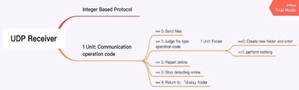

# Large Efficient Fast Trusty File Sharing Application  

Abstract

There is a plenty of network-based file sharing applications in nowadays world such as iCloud and Dropbox. After studying the module ‘Introduction to Networking’, a coursework was given to develop a Large Efficient Flexible and Trusty (LEFT) File Sharing Applications. Thus, this report will firstlyintroduce the background and demonstrate necessary literature re- view about such file sharing applications. Followed by that, the design methodology such as general ideas and app structure will be depicted in detail to give the audience a clear under- standing of it. To the next, the specific implementation will be reported, which mainly focus on the programming skills used and dilemma in implementation. After the development is complemented, it will be necessary to design certain testing plans to judge the performance and whether all the requirements are fulfilled. Moreover, there will be some critical analysis of this app which points out the potential defects and limitations. To the end, it will end with a general but accurate conclusion, together with appropriate future plans and researches about how improve the transmission speed.

Keywords: File sharing application, Python Socket Programming, Network

A. Introduction
1. Problem Statement

We are required to develop a file sharing application via using Python Socket network pro- gramming techniques in this coursework [1]. Basically, the developed application should have four specific properties, say, large, efficient, flexible and trusty which will be demonstrated in detail as followed. Firstly, large refers to large file transmission which size is over 1 GB and any type of files should be taken into consideration such as folders and hidden files [1]. Fol- lowed by that, Efficient means it should be developed as a comprehensive application which performs a high transmission efficiency. Moreover, automatic file synchronization and partial update function are also required in this part. The property flexible figures that in this app the IP addresses should be set as an argument and the property trusty points that the certain mecha- nism such as encryption and recovering from interruption should be implemented. Above all, it is quite a challenge coursework for Year 3 students to complete due to copious and demanding requirements to fulfilland the sang in coding.

2. Background and Literature Review

In recent years, there are many emergent file sharing applications based on network such as Dropbox and iCloud [1]. One reason accountable for the population is such cloud storage method bring convenience when compared to traditional hard storage devices. Moreover, it could guarantee the files security of users even in transmission [2]. Taking a sterling platform Dropbox as an example, the design of its security mechanism is quite astute. It requires two separate steps of verification before used that not only a private password is required but a verification code sent to customer’s mobile phone is need [3]. With such two steps, many Internet attacks may be prevented. Actually, there are different kinds of advantages of other existing file sharing applications which is worthy of studying and following. However, as a novice in computer science who have just studied networking, the firststep is develop my own filesharing application (Ethan’s box) which could fulfillthe coursework requirements.

B. Methodology

This part will illustrate the methodology and the general design method of the file sharing application (Ethan’s box) which covers four significantsections: general design idea, transmis- sion method, protocol design and application structure. More accurate and specificdescription and implementation steps will be demonstrated later in this report.

1. General Design Idea

Different from the prevalent design method among university students, this file sharing ap- plication is designed as an active mode. It refers that when a file is manually added in the current directory or is partially updated, the program will send it (or just send the partially updated part) to the same directory of its peers, other than other peers request for the newly appeared one. This mechanism could attenuate substantial computing and comparison costs of the filelists when compared to the passive design mode, because it is not necessary for sender and receiver to discern what files other parts have. Moreover, due to the reduced communica- tion burden among the busting Internet, this design method saves bandwidth for more efficient transmission of files[2].

2. Transmission Method

In Ethan’s box, two eminent protocols in transport layer, say TCP and UDP are mixed and applied together. Due to the reliable data transmission, TCP in the app is only accountable for receiving filesto avoid unstable problems such as packet loss and receiver overflow. Moreover, it could guarantee the transmission efficiency because of the segment sent as stream in TCP. However, UDP protocol in Ethan’s box is mainly utilized for communication between peers. Compared with transmitting files, communication requires less reliability of the Internet but a demanding timeliness. There is no need for UDP to perform handshaking, so it is a judicious choice to harness UDP to communicate. Although two protocols in transport layers are mixed together, it is still possible that there may be a congestion in network when transmitting files.

3. Protocol Design

Since the protocol in this methodology is mainly applied in UDP communication among peers, there is no need to design complex and cumbersome protocols and make packets. More- over, in order to save bandwidth of the Internet, the format of protocol is just designed as some integers other than the normal human-readable type. Here is a mind map illustrating the comprehensive protocol.

Figure 2.1: Protocol Design

4. Application Structure

According to the function of each modules and the description mentioned above, the app is designed via applying multithread programming techniques and it should contain four threads in main thread. Firstly, since the requirement for three hosts’ filessharing, two thread should be responsible for detecting whether there are any filesadded or whether the existing filehas been modifiedfor other two peers. Once detected, it should continue to discerning whether other two peersonlineviasendingUDPmessage. Ifonline, aftercertaincommunicationamongthehosts, file transmission starts. To the next, as mentioned above, there must be a thread accountable for UDP message receiving and another TCP thread for filecontents receiving. Actually, there are many momentous modules and functions in each thread which will be mentioned later in implementation part. To give readers a clear understanding of the structure, an activity diagram is showed as followed.

Figure 2.2: File Sharing Activity Diagram

C. Implementation
1. Module Specification

Accordingtothedesignideaandmethodologymentionedabove,theapplicationisdeveloped incrementally in each step. In each round, there will be some new features and functions added to the current one. The table as followed will demonstrate all the functions defined in this program. A function marked with [Function] means it only completes one essential task such as getting fileblock and filesize. One marked with [Module] which may perform a composite function is used in thread and the one denoted with [Thread] refers to actual thread running in the program.

Table 3.1: Important Functions in Program

|Function Name|Description|
| - | - |
|[Function] argparse()|Run program with arguments|
|[Thread] detectNewFile(ipAddr)|Detect fileadded and updated|
|[Module] detectOnline(ipAddr)|Send UDP msg to peers to detect whether online|
|[Thread] RecoverThread(ipAddr, recoverFile)|Called when peers online again after interruption|
|[Module] sendFile(newFile, ipAddr, idString)|Send fileto peers|
|[Module] updateFile(newFile, ipAddr, idString)|Send updated part of modifiedfileto peers|
|[Module] sendEncFile(newFile, ipAddr, idString)|Send filewith encryption|
|[Module] broadcast(newFile, ipAddr)|Send fileinformation to peers|
|[Function] getFileSize(fileName)|Get filesize|
|[Function] getFileBlock(fileName)|Get each block of file|
|[Thread] receive()|Thread for receiving files|
|[Thread] udpReceive()|Thread for communication|
|[Function] createShare()|Create share folder if not exist|
2. Programming Skills

In this coursework, two specificprogramming skills are used to implement certain functions. Since the application should be both client and server and should be workable during its lifecy- cle, multithreadingtechniqueisneeded. Whenappstarts, themainthreadwillforkanotherfour separate threads which are responsible for diverse functions. For instance, one thread is used for detecting new filesand modificationswhile another is accountable for communicating with other peers. One tricky thing worthy observing is the synchronization of threads, since a global variable may be visited or changed by different threads at the same time. In this program, two event locks named sendEvent and folderEvent are used to avoid such race condition. Secondly, another significant technique, say OOP is taken into consideration in encryption part. There is a class MYDESCrypt which contains the encrypt and decrypt method. When encryption is needed in file transmission, a new MYDESCrypt object will be instantiated and its related methods will be called.

3. Difficultiesand Solutions
1. Recover from interruption

One specificrequirement claims that the application should have the ability to recover from interruptionwhichmeansallthefilesshouldalsobesynchronizedwhensharedduringitsdown- time. One possible solution is illustrated as followed. When interruption occurs, the TCP connection will not set up and there will be an error reported by Python. Thus, a ‘try catch’ statement is expected to solve the problem. When connection refused error reported, the pro- gram will return back to previous phase to detect whether the killed peer online again. When it comes online, the sender will execute the same flow after online detection.

2. Thread synchronization

When a global variable is visited or changed by different threads at the same time, it will result in a great catastrophe. In this program, when a folder and a big file are put into sharing directory simultaneously, it is possible that the big file is transmitted into the folder or folder files are transmitted outside it. Since the current sharing directory ‘subfileDir’ will change when folder operation occurs, it is necessary to use event lock to protect such variable. After adding locks in the program which make that only big file transmission ends can folder starts transmitting, the wrong position transmission problem is solved.

D. Testing and Results

Testing environment: Linux Tiny Core (Python 3.6.9 installed)

Before testing, the main.py filewill be copied to three different virtual machines and started by passingtheIPaddressesofothertwopeers. Thetestingplanfollowsmarkingcriteriamentioned in coursework specification strictly. In the first phase, File1 which size is around 30 MB is added to VMA share folder. Then the application inside VMB starts and contrives to receive File 1 sent from VMA, so does VMC. The time consuming of this transmission is less than 1 second. In the next phase, a folder teeming with 50 small files and a 1.4 GB large mp4 file are put into the share directory of VMB. VMA and VMC starts synchronizing these files at the same time. However, application running in VMA will be killed by ‘Ctrl C’ after 2 seconds while VMC is receiving these files. After VMC has received such files, VMA will be restarted and continue its synchronization. As the screenshot Figs. 4.1 and 4.2 shows, it is convincing that VMA can still make files synchronized even killed manually. Moreover,

 

Figure 4.1: Files in VMB Figure 4.2: Received in VMA

the time consuming which reaches 31Mbps is not worse than before. When above two phases testing are passed, the next step will be a test for file updating mechanism. File3 around 200 MB is copied to VMC and will be synchronized to VMA and VMB. Followed by that, a Python script named modifyFile.py will be executed to change the first 0.1 percent of File3. As the screenshot Figs. 4.3 and 4.4 shows, VMC starts to send the modified part of File3 to VMA and VMB. To the end, the program located in three different virtual machines are restarted

 

Figure 4.3: Modify Files and Send Figure 4.4: File Updated in VMA

with an encryption mode. As the operation of phase one performed above, there will also be a test on single mini file transmission. Although the time consuming increased, the security during transmission is guaranteed by applying DES encryption. However, according to testing screenshots, there is a major defect in this application. When two or more files are placed into sharing directory simultaneously, fileswill be synchronized one by one other than parallel sharing that is owing to locks used in multithreading programming. Moreover, the bandwidth is not fully utilized during transmission because of just one TCP connection set at one time. Above all, although it seems that all the necessary functions are implemented successfully in Ethan’s box, the transmission rate is restricted to around 30 Mbps due to reasons mentioned above.

E. Conclusions

To sum up, this report is designed to depict a file sharing application named Ethan’s box through the design methodology and specificimplementation. In implementation, it mentioned two significant programming skills that OOP and multithreading programming. Moreover, several dilemmas in the development process and appropriate solutions were demonstrated. In terms of requirement fulfillment and performance, necessary testing plans were carried out and relative analysis were provided. However, although all the requirements were fulfilled in this app, the question raised by this report will focus on how to improve transmission speed and how to allow many files synchronized at the same time. In the future plan, deep study about multithreading used in filetransmission may be performed. Moreover, there should be a specificresearch on how to utilize more bandwidth of the Internet during transmission.
